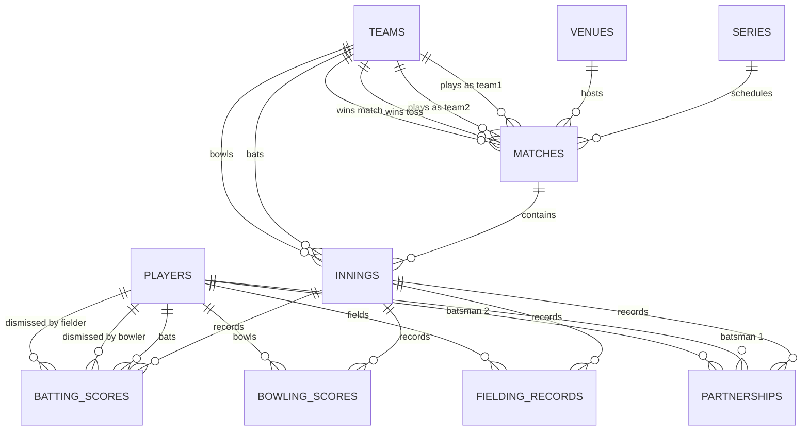

# 🏏 Cricbuzz LiveStats Platform

<div align="center">

[](https://python.org)
[](https://postgresql.org)
[](https://github.com/YashwanthNavari/-Cricbuzz-LiveStats/actions)
[](https://w2h2kfk6yk63r2qhoxrbql.streamlit.app/)

### ⚡ [🚀 CLICK HERE TO VISIT THE LIVE DASHBOARD 🚀](https://w2h2kfk6yk63r2qhoxrbql.streamlit.app/) ⚡

*Explore real-time cricket matches, normalized statistics, and data quality check results instantly!*

</div>

---

Real-Time Cricket Ingestion, Third Normal Form (3NF) Normalization, Data Quality Diagnostics, and a 12-Page Analytics Dashboard built using Python, SQLite/PostgreSQL, SQL, Plotly, and the Cricbuzz RapidAPI.

---


---

## 🚀 Key Features

* **🔌 Live API Explorer:** Send test pings directly to Cricbuzz endpoints to evaluate real-time JSON responses and track HTTP request latencies.
* **⚙️ Automated Ingestion (ETL):** Auto-transforms complex nested JSON payloads into relational data tables, featuring resume and quota saving states.
* **🛡️ Integrity Checker & Auto-Fix:** Dynamic diagnostics checking database constraints (PKs, FKs, duplicates) and a programmatic corrector to repair cricket overs formats.
* **📊 SQL Analytics (25 Queries):** Execute, evaluate, and visualize 25 complex SQL queries (Points tables, rolling averages, team head-to-heads) with CSV/Excel export formats.
* **📈 Rich Dashboard Comparisons:** Compare team performance graphs, batsman strike rates, bowler economy curves, and venue averages using Plotly.
* **🧪 QA & Diagnostics Center:** Run automated database connection checks, CRUD operation verifications, and pipeline unit tests from the web interface.

---

## 🗄️ Relational Database Schema (3NF)

The database schema is meticulously designed in **Third Normal Form (3NF)** to avoid redundant states and optimize analytical querying:



---

## 📁 Repository Structure

All code is flattened directly at the repository root for clean Python distribution and packaging:

<details>
<summary>📂 Click to Expand Directory Tree</summary>

```text
cricbuzz-livestats/
│
├── .github/
│   └── workflows/
│       └── python.yml          # GitHub Actions CI workflow (pytest, black, isort, flake8)
│
├── api/                        # Cricbuzz API endpoints package
│   ├── __init__.py
│   ├── client.py               # Reusable API Client with rate limiting and local cache
│   ├── matches.py              # Matches list endpoints
│   ├── players.py              # Player profile endpoints
│   └── scorecard.py            # Detailed scorecard endpoints
│
├── assets/                     # Screenshots, diagrams, and banners
│   ├── architecture/
│   │     └── readme_banner.png # Generated header banner
│   ├── icons/
│   └── screenshots/
│
├── database/                   # Schema Models & Configurations
│   ├── __init__.py
│   ├── db.py                   # SQLAlchemy connection session & auto-migrations
│   ├── models.py               # 10 SQLAlchemy ORM models
│   ├── queries.py              # 25 analytical SQL queries
│   └── schema.sql              # Raw PostgreSQL schema DDL
│
├── docs/                       # Comprehensive System Documentation
│   ├── ARCHITECTURE.md
│   ├── API_MAPPING.md
│   ├── DATABASE_DESIGN.md
│   ├── DATASET_PIPELINE.md
│   └── SQL_ANALYTICS.md
│
├── logs/                       # Rotating runtime diagnostic file outputs
│   └── pipeline.log
│
├── pages/                      # Multipage Streamlit Dashboards
│   ├── __init__.py
│   ├── analytics_dashboard.py
│   ├── api_explorer.py
│   ├── crud_operations.py
│   ├── data_validation.py
│   ├── database_viewer.py
│   ├── dataset_builder.py
│   ├── home.py
│   ├── json_explorer.py
│   ├── logs_page.py
│   ├── performance_page.py
│   ├── sql_analytics.py
│   └── testing_page.py
│
├── processed_data/             # Ingestion reports and CSV/Excel exports
│   └── reports/
│
├── raw_data/                   # Local raw JSON file cache
│   ├── matches/
│   └── scorecards/
│
├── services/                   # Business Logic & Normalization Services
│   ├── __init__.py
│   ├── ingestion.py            # Ingestion pipeline orchestrator
│   ├── transformer.py          # Normalization transformers
│   └── validator.py            # Pydantic schema validation
│
├── tests/                      # Testing & QA Center
│   ├── __init__.py
│   └── test_pipeline.py        # Automated python unit tests
│
├── .env.example                # Configuration template settings
├── .gitignore                  # Git excluded directories
├── app.py                      # Streamlit entry point
├── CHANGELOG.md                # Release version summaries
├── CONTRIBUTING.md             # Developer guidelines
├── LICENSE                     # MIT license terms
├── README.md                   # Onboarding setup instructions
├── run_pipeline.py             # CLI pipeline entry point
├── requirements.txt            # Package dependencies list
└── validate_dataset.py         # CLI dataset validation entry point
```
</details>

---

## 📊 SQL Analytics Catalog (25 Queries)

The system includes pre-defined SQL analytics compatible with SQLite and PostgreSQL:

<details>
<summary>🔍 Click to Review 25 SQL Analytical Queries</summary>

1. **Q1:** Series Points Table (Played, Wins, Losses, Points, and Net Run Rate).
2. **Q2:** Top 10 Run-Scorers in a tournament.
3. **Q3:** Most wickets taken in a series.
4. **Q4:** Highest Strike Rates (min 100 balls faced).
5. **Q5:** Best economy rates (min 15 overs bowled).
6. **Q6:** Toss Impact on Match Outcomes.
7. **Q7:** Top 5 Highest Batting Partnerships.
8. **Q8:** Most catches taken by a fielder.
9. **Q9:** Most stumpings taken by a keeper.
10. **Q10:** Head-to-Head Records between two teams.
11. **Q11:** Average runs scored per innings at each venue.
12. **Q12:** Chasing vs Batting first win rates at each venue.
13. **Q13:** Players with most "Player of the Match" awards.
14. **Q14:** Bowlers with most maiden overs.
15. **Q15:** Most sixes hit by a batsman.
16. **Q16:** Wicket-takers classified by dismissal types.
17. **Q17:** Batsmen who remained Not Out the most times.
18. **Q18:** Rolling Average of runs for a player over last 5 matches.
19. **Q19:** Consistency evaluation (standard deviation proxy) of top batsmen.
20. **Q20:** Best bowling spells in a single match.
21. **Q21:** Most prolific batting pairs (cumulative partnerships).
22. **Q22:** Teams with highest boundary runs ratio.
23. **Q23:** Extras conceded ratio per innings.
24. **Q24:** Active live matches list.
25. **Q25:** Target chasing success rates.
</details>

---

## 🛠️ Installation & Getting Started

### 1. Prerequisites
Ensure you have **Python 3.11+** installed. Clone the repository and navigate inside:
```bash
git clone https://github.com/YashwanthNavari/-Cricbuzz-LiveStats.git
cd -Cricbuzz-LiveStats
```

### 2. Environment Configuration
Create a `.env` file in the root workspace folder:
```text
RAPIDAPI_KEY=your_cricbuzz_rapidapi_key
RAPIDAPI_HOST=cricbuzz-cricket.p.rapidapi.com
DATABASE_URL=sqlite:///cricbuzz_db.sqlite
```

### 3. Install Dependencies
Initialize your virtual environment and install standard requirements:
```bash
python -m venv .venv

# Activate:
# Windows:
.venv\Scripts\activate
# macOS/Linux:
source .venv/bin/activate

pip install -r requirements.txt
```

### 4. Run the Platform
Launch the Streamlit multi-page dashboard:
```bash
python -m streamlit run app.py
```
Open **[http://localhost:8501](http://localhost:8501)** in your browser!

---

## 🛡️ License
Distributed under the MIT License. See `LICENSE` for details.
