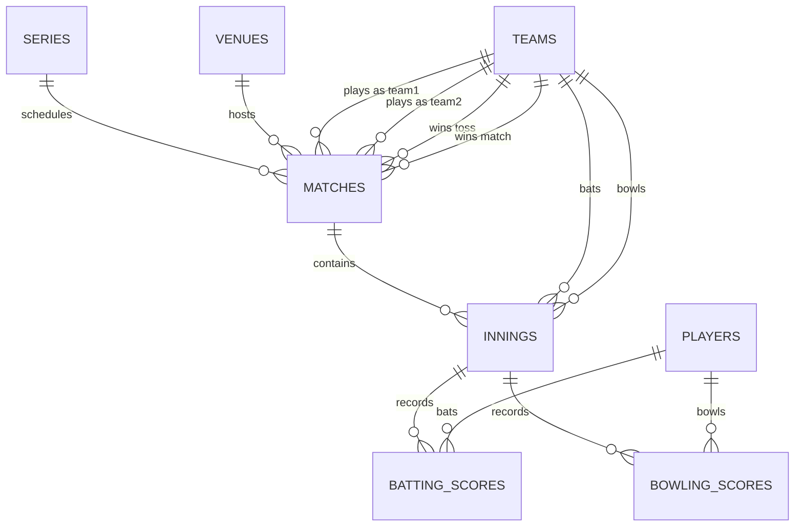

# Cricbuzz RapidAPI Reverse Engineering & API Mapping Document

This document provides a technical reverse engineering analysis of the Cricbuzz Cricket API (hosted at `cricbuzz-cricket.p.rapidapi.com` on RapidAPI). It specifies endpoint details, parameter constraints, JSON structure mappings, database normalizations, and relationship constraints.

---

## 1. GET `/matches/v1/live`

### Purpose
Retrieves a list of currently active (live) cricket matches, including real-time metadata.

### Required Parameters
* None (optional query filters like `formatType` can be used to filter by Test, ODI, T20, etc.).

### Returned JSON Structure
```json
{
  "typeMatches": [
    {
      "matchType": "International",
      "seriesMatches": [
        {
          "seriesAdWrapper": {
            "seriesId": 3813,
            "seriesName": "ICC Men's T20 World Cup 2026",
            "matches": [
              {
                "matchInfo": {
                  "matchId": 89452,
                  "matchDescription": "Super 8 - Match 12",
                  "matchFormat": "T20",
                  "matchState": "Live",
                  "status": "India opt to bat",
                  "startDate": "1719673200000",
                  "team1": {
                    "teamId": 2,
                    "teamName": "India",
                    "teamSName": "IND"
                  },
                  "team2": {
                    "teamId": 9,
                    "teamName": "South Africa",
                    "teamSName": "RSA"
                  },
                  "venueInfo": {
                    "id": 12,
                    "name": "Kensington Oval",
                    "city": "Bridgetown",
                    "country": "Barbados"
                  }
                }
              }
            ]
          }
        }
      ]
    }
  ]
}
```

### Normalization Strategy
Deconstruct the nested list structure by walking through `typeMatches` -> `seriesMatches` -> `seriesAdWrapper` -> `matches`. 
* Extract the **Series** record.
* Extract the **Venue** record.
* Extract the **Team** records (`team1` and `team2`).
* Create or update the parent **Match** record linking to the series, venue, and teams.

### Database Tables
* `series` (Upsert: `seriesId`)
* `venues` (Upsert: `venueInfo.id`)
* `teams` (Upsert: `teamId`)
* `matches` (Upsert: `matchId`)

### Relationships
* `matches.series_id` $\rightarrow$ `series.id` (Many-to-One)
* `matches.venue_id` $\rightarrow$ `venues.id` (Many-to-One)
* `matches.team1_id` $\rightarrow$ `teams.id` (Many-to-One)
* `matches.team2_id` $\rightarrow$ `teams.id` (Many-to-One)

### Notes
* Live match scores change frequently. For live tracking, this endpoint is polled periodically, and details are updated.
* `startDate` is in Unix epoch milliseconds and must be converted to a timezone-aware Timestamp.

---

## 2. GET `/matches/v1/recent`

### Purpose
Retrieves recently concluded cricket matches with results.

### Required Parameters
* None.

### Returned JSON Structure
Matches the same nested hierarchy as `/matches/v1/live`. The `matchState` field changes to `"Complete"`, and the `status` field contains the final result string (e.g., `"India won by 7 runs"`). A `result` object is populated under `matchInfo` with the `winnerId`.

### Normalization Strategy
* Walk the nested arrays to extract `series`, `venues`, `teams`, and `matches`.
* Store `winnerId` in the `matches` table.
* Since the match is completed, use the `matchId` to enqueue a downstream fetch for the full scorecard endpoint.

### Database Tables
* `series`
* `venues`
* `teams`
* `matches`

### Relationships
* `matches.series_id` $\rightarrow$ `series.id` (Many-to-One)
* `matches.venue_id` $\rightarrow$ `venues.id` (Many-to-One)
* `matches.winner_id` $\rightarrow$ `teams.id` (Many-to-One)

### Notes
* Highly useful as the driver for batch historical backfills. Running this endpoint gives you list of all recently completed match IDs which you can feed to the scorecard scraper.

---

## 3. GET `/matches/v1/upcoming`

### Purpose
Retrieves future scheduled fixtures.

### Required Parameters
* None.

### Returned JSON Structure
Identical structure to `/matches/v1/live`, with `matchState` set to `"Upcoming"` or `"Ad-hoc"`. The `status` field contains details of date/time or is blank. No result parameters or toss parameters are populated.

### Normalization Strategy
* Walk the structure and write `series`, `venues`, `teams`, and `matches` records.
* Set fields like `winner_id`, `toss_winner_id`, and `toss_decision` to `NULL`.

### Database Tables
* `series`
* `venues`
* `teams`
* `matches`

### Relationships
* Identical foreign key relationships to `/matches/v1/live`.

---

## 4. GET `/mcenter/v1/{matchId}/hscard`

### Purpose
Retrieves the full detailed scorecard for a concluded or ongoing match, containing all innings, batsman runs/balls/fours/sixes, and bowler overs/maidens/runs/wickets.

### Required Parameters
* `matchId` (Path Parameter, Integer)

### Returned JSON Structure
```json
{
  "matchId": 89452,
  "scorecard": [
    {
      "inningsId": 1,
      "battingTeamId": 2,
      "bowlingTeamId": 9,
      "runs": 176,
      "wickets": 7,
      "overs": 20.0,
      "batsmenData": {
        "101": {
          "batName": "Virat Kohli",
          "runs": 76,
          "balls": 59,
          "fours": 6,
          "sixes": 2,
          "strikeRate": 128.81,
          "outDesc": "c Jansen b Maharaj"
        }
      },
      "bowlersData": {
        "201": {
          "bowlName": "Anrich Nortje",
          "overs": 4.0,
          "maidens": 0,
          "runs": 26,
          "wickets": 2,
          "economy": 6.5
        }
      }
    }
  ]
}
```

### Normalization Strategy
1. Validate that the parent `matches` record with `id = matchId` exists in the database.
2. Iterate through the `scorecard` array:
   - Extract the `Innings` record containing innings totals.
   - For each batsman in `batsmenData`:
     - Extract player metadata (Player ID, Player Name) to populate the `players` table (to prevent foreign key errors).
     - Populate `batting_scores` mapping player and innings performance.
   - For each bowler in `bowlersData`:
     - Extract player metadata to populate the `players` table.
     - Populate `bowling_scores` mapping player and innings performance.

### Database Tables
* `players` (Extract: `player_id` and name)
* `innings` (Insert/Update: `match_id` + `innings_num`)
* `batting_scores` (Insert/Update: `innings_id` + `player_id`)
* `bowling_scores` (Insert/Update: `innings_id` + `player_id`)

### Relationships
* `innings.match_id` $\rightarrow$ `matches.id` (Many-to-One, Cascade Delete)
* `batting_scores.innings_id` $\rightarrow$ `innings.id` (Many-to-One, Cascade Delete)
* `batting_scores.player_id` $\rightarrow$ `players.id` (Many-to-One, Cascade Delete)
* `bowling_scores.innings_id` $\rightarrow$ `innings.id` (Many-to-One, Cascade Delete)
* `bowling_scores.player_id` $\rightarrow$ `players.id` (Many-to-One, Cascade Delete)

### Notes
* High density endpoint containing player profile mapping. Crucial to parse `batName` and `bowlName` dynamically here, saving hundreds of extra API calls to individual player endpoints.

---

## 5. GET `/stats/v1/player/{playerId}`

### Purpose
Retrieves complete player profile details (batting/bowling styles, date of birth, role, image, etc.).

### Required Parameters
* `playerId` (Path Parameter, Integer)

### Returned JSON Structure
```json
{
  "player": {
    "playerId": 101,
    "name": "Virat Kohli",
    "battingStyle": "Right-hand bat",
    "bowlingStyle": "Right-arm medium",
    "role": "Batsman",
    "image": "https://cricbuzz.com/players/101.jpg"
  }
}
```

### Normalization Strategy
Directly update the corresponding player record in the `players` table with high-fidelity info (batting/bowling style, role, profile image URL).

### Database Tables
* `players` (Upsert: `playerId`)

### Relationships
* None (leaf entity in normalization hierarchy).

### Notes
* Since Cricbuzz limits free API calls, player profiles can be backfilled asynchronously or on-demand when user requests stats rather than loading every player profile during the live match ingestion run.

---

## 6. GET `/series/v1/list`

### Purpose
Lists all cricket series / tournaments (active, recent, upcoming).

### Required Parameters
* None.

### Returned JSON Structure
```json
{
  "series": [
    {
      "seriesId": 3813,
      "seriesName": "ICC Men's T20 World Cup 2026",
      "startDate": "1719673200000",
      "endDate": "1719759600000",
      "seriesType": "International"
    }
  ]
}
```

### Normalization Strategy
Iterate through the `series` array and write metadata to the `series` table.

### Database Tables
* `series` (Upsert: `seriesId`)

### Relationships
* Parent table of matches. None required during insert.

---

## 7. GET `/series/v1/{seriesId}`

### Purpose
Fetches all matches scheduled or played within a specific Series/Tournament.

### Required Parameters
* `seriesId` (Path Parameter, Integer)

### Returned JSON Structure
```json
{
  "seriesId": 3813,
  "seriesName": "ICC Men's T20 World Cup 2026",
  "matches": [
    {
      "matchInfo": {
        "matchId": 89452,
        "matchDescription": "Final",
        "matchFormat": "T20",
        "team1": { "teamId": 2, "teamName": "India" },
        "team2": { "teamId": 9, "teamName": "South Africa" },
        "venueInfo": { "id": 12, "name": "Kensington Oval" }
      }
    }
  ]
}
```

### Normalization Strategy
Verify that the Series exists, then iterate and upsert teams, venues, and matches.

### Database Tables
* `venues`
* `teams`
* `matches`

### Relationships
* Match links to series via `series_id`.

---

## 8. GET `/teams/v1/{teamId}/results`

### Purpose
Fetches historic match results for a specific team.

### Required Parameters
* `teamId` (Path Parameter, Integer)

### Returned JSON Structure
Contains a root `matches` array containing historic `matchInfo` objects where `team1` or `team2` matches the `teamId`.

### Normalization Strategy
Parse each match record, upserting its metadata and matching fields.

### Database Tables
* `series`
* `venues`
* `teams`
* `matches`

---

## 9. GET `/teams/v1/{teamId}/schedule`

### Purpose
Fetches upcoming matches for a specific team.

### Required Parameters
* `teamId` (Path Parameter, Integer)

### Returned JSON Structure
Lists upcoming fixtures where the team participates.

### Normalization Strategy
Same as team results, writing upcoming match definitions.

### Database Tables
* `series`
* `venues`
* `teams`
* `matches`

---

## 10. GET `/venues/v1/{venueId}`

### Purpose
Fetches scheduling and metadata for a specific Cricket venue.

### Required Parameters
* `venueId` (Path Parameter, Integer)

### Returned JSON Structure
```json
{
  "venueId": 12,
  "name": "Kensington Oval",
  "city": "Bridgetown",
  "country": "Barbados",
  "capacity": 28000,
  "matches": [
    {
      "matchId": 89452,
      "matchDescription": "Final"
    }
  ]
}
```

### Normalization Strategy
Extract the venue's details (city, country, capacity) and upsert into the `venues` table. Then iterate and create/update matches records.

### Database Tables
* `venues` (Upsert: `venueId`)
* `matches`

### Relationships
* `matches.venue_id` $\rightarrow$ `venues.id` (Many-to-One)

---

## Entity Relationship Summary (SQL mapping)


