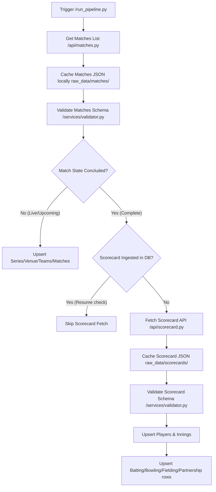

# Cricbuzz Dataset ETL Ingestion Pipeline

This document explains the technical design, directory structure, data validation, and resume mechanics of the automated **Cricbuzz LiveStats ETL Pipeline**.

---

## 1. Pipeline Architecture

The ingestion pipeline is implemented as an automated, multi-stage Extract-Transform-Load (ETL) orchestrator inside `services/ingestion.py`:



---

## 2. Ingestion Cache Hierarchy

To prevent redundant API consumption and preserve RapidAPI quotas, the pipeline implements a local filesystem cache inside `raw_data/`:

* **`raw_data/matches/`**: Subfolders partitioned by category, containing the response arrays returned from `/matches/v1/{recent|live|upcoming}`.
* **`raw_data/scorecards/`**: JSON files named by match ID (e.g. `91689_hscard.json`) representing concluded matches scorecard snapshots.
* **`raw_data/players/`**: Cached player profiles mapped by `playerId`.

---

## 3. Resume & Quota Preservation Mechanics

1. **Check DB State:** Before pinging the Cricbuzz API for a detailed scorecard (`/mcenter/v1/{id}/hscard`), the pipeline queries the `innings` table:
   ```sql
   SELECT COUNT(*) FROM innings WHERE match_id = :match_id;
   ```
2. **Short Circuit:** If innings records are already present, the pipeline assumes ingestion is complete and skips the network request entirely.
3. **Overwrite Option:** If the match is currently "Live", the pipeline skips the short circuit to continuously update innings scores and player stats on successive runs.

---

## 4. Quality Rules & Validation Checks

The system implements Pydantic-based JSON schema checking before writing to the database:

* **Matches Schema Validation (`services/validator.py`):** Ensures required fields like `matchId`, `team1`, and `team2` exist and have valid types.
* **Scorecard Validation (`services/validator.py`):** Checks for nested batsman and bowler lists, score values, and overs limits.
* **Overs Format Corrections (`validate_dataset.py`):** Detects invalid over decimal counts. Cricket overs are Base 6 (6 balls = 1 over). Decimal parts above `.5` (like `14.6` or `14.7`) are anomalies. The validator's auto-fix engine automatically rounds these records up to the correct integer bounds (e.g., `14.6` is updated to `15.0`).
